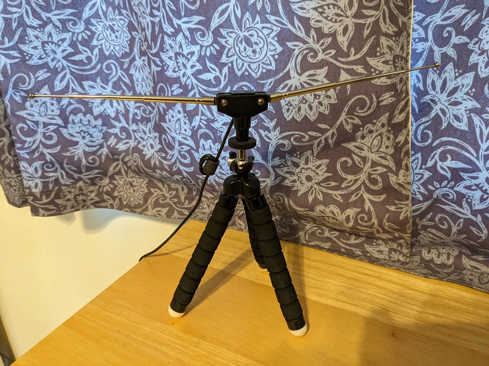
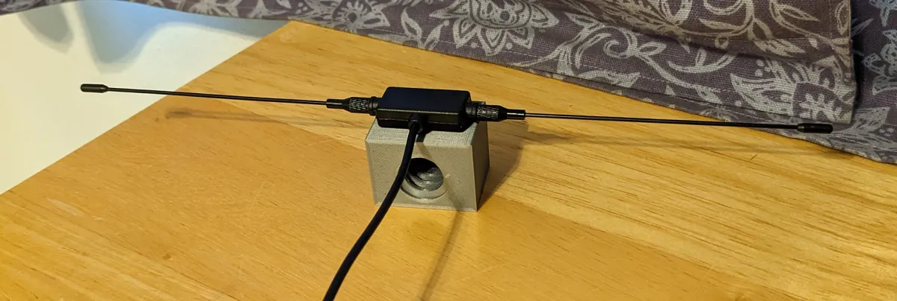
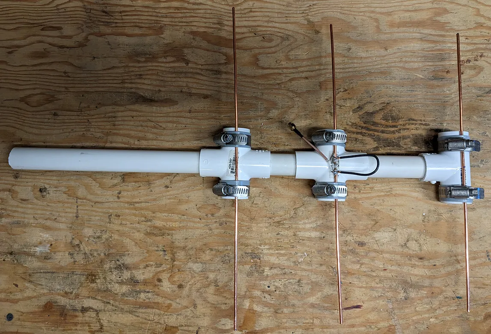
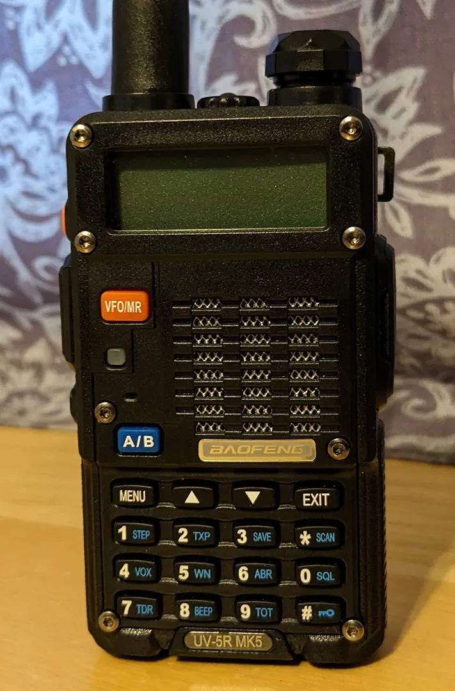

# Balloon Tracking and Antennas
September 5, 2022
A friend send me [this](https://spectrum.ieee.org/chasing-weather-balloons-with-sdr) post as something to think about trying to do with the KrakenSDR. However, before going crazy trying to drive after weather balloons, I wanted to just see if I could pick up a signal from one using an SDR and SDRSharp. The first place to go to look at your options and see what others are doing is [SondeHub](https://tracker.sondehub.org/). This site will show you all the weather balloons that any registered station can detect, on earth. It will also show you if you have a site nearby that flies regular balloons which take off twice a day from hundreds of locations around the globe and about 100 in the U.S. There is such a site at the Oakland airport, so I can try twice a day to detect a signal. I didn’t have an antenna for the exact 404 MHz frequency that they use there, but I did have this rabbit ears dipole that goes down to about 433.

This did not go quite long enough to get to 404, but I tried anyway and did not see anything. So the next step was to use this:

I screwed this dedicated 433 MHz antenna to an extendable pole, put it up near the roofline and tried again. This time I saw just the faintest capture of the signal from the balloon and something pretty clear at 405 MHz. So now is a good time for a confession; I was probably doing it wrong at this point. If you look at the [Wiki page](https://en.wikipedia.org/wiki/Dipole_antenna) for a dipole, it will show you nice dual bulb graph of the radiation/reception pattern for a dipole. However, if you are not paying careful attention, you might think that pointing a lead of the antenna toward the balloon would be a good thing. It is not. You actually want the direction of travel of the wave you are trying to detect to be perpendicular to the antenna elements. The Oakland balloon probably would have shown up fine, had I rotated the pole 90 degrees or mounted the antenna vertically. The stronger signal turned out to be a balloon launched out of Moss Landing that had almost made it to Morgan Hill, which is only 20 miles away and the antenna element was not pointed right at it. This was nice, because now I knew the half second on/off pulse that the transmitter on the balloons shows up as.

At this point I thought I needed a better antenna and I figured I would need something directional eventually if I ever try to recover a balloon (assuming that I would not be able to drive the roof-mounted Kraken antenna array right to a balloon). So just build a Yagi antenna in an hour, right? Things looked great starting out, with lots of information about doing this showing up on a web search. I was thinking to build a five element for use mounted on the pole at home and then a three element to actually bring with to find a balloon. There are a number of calculator sites and recommendations about element length and assembly. I ended up using [this one](https://sites.google.com/view/kn9b/yagi) as it was pretty simple. I also decided I would use PVC as the mast material and was keen to have it fold up and fit inside the PVC pipe for storage and transport. I was going to make the five element version first to be sure I could clearly pick up the Oakland balloons. However, the mounting clips I got were labeled for the exterior diameter of my PVC, even though the PVC is labeled for the interior diameter. So back to the hardware store, but there is no one inch version of that clip with the flat top, so I got a one inch galvanized clip that did not look like it would work as well. These turn out to be labeled for the interior diameter (or an incredibly loose fit). I briefly considered designing and 3-D printing something, but I was already supposed to be done by now. After sleeping on it, I decide to pivot to [this design](https://www.youtube.com/watch?v=BmHoQrDfw-0) and to start with the three element version. Then the next problem is the hair-pin or balun that is needed to make the antenna 50 ohms. It has been very difficult to find a design that is both for something about 400 MHz and gives the dimensions of the gap between the diver elements and the gauge and length of the hairpin wire. I got so tiered of searching for a design that includes this information and starting to read dense explanations of antenna theory and trying to figure out how antenna software works, that I decide to just shorten things up a bit from the lengths in the video (which was for a lower frequency) and hope for the best. After the worst soldering job ever (three things together at the same time always gets me) I have this monstrosity.

It actually works! I actually have trouble getting much direction out of it as it seemed to still pick up the balloon pretty well 90 degrees off. Maybe the balloon was so high at that point that I would need to tip off of horizontal? Anyway, the signal was so strong, that this is where I started thinking that I had done something wrong previously. I was just holding this thing while sitting down, it was not above the roofline and the balloon was between 40 to 50 miles away. So after I packed that all up, I wondered. Would the webs' most hated radio be able to detect the balloon?

No problem. Of course, it just has half-second blips of static, but as I waive it around and look at the signal strength indicator I realize what I did wrong before. If I point the aerial right at the balloon, I get nothing. At 90 to the balloon I get full strength. In fact, I could probably just use this to wander towards a downed balloon using a signal gap as an indication that the aerial is pointing towards the transmitter. Probably more later on this topic.
