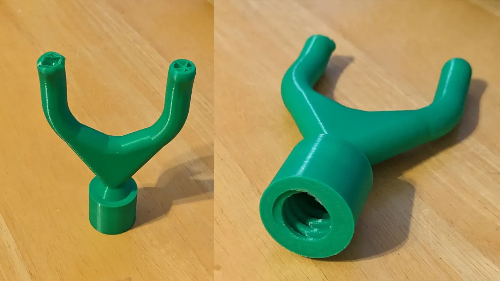
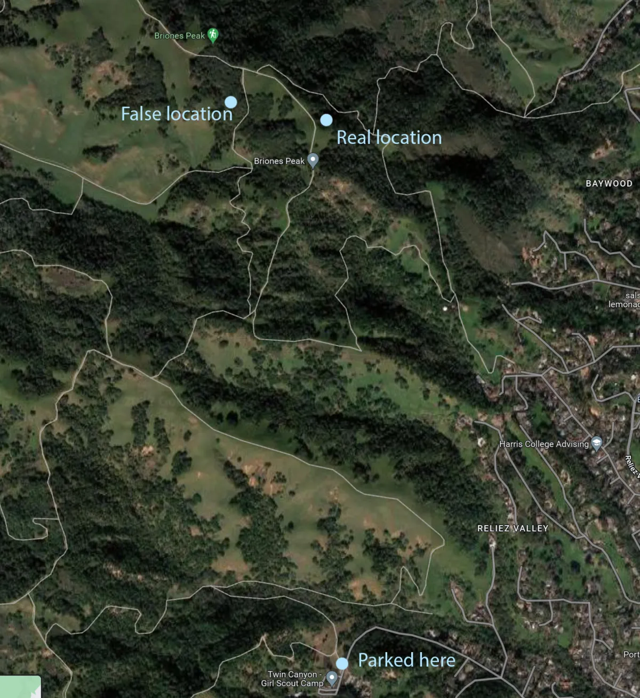
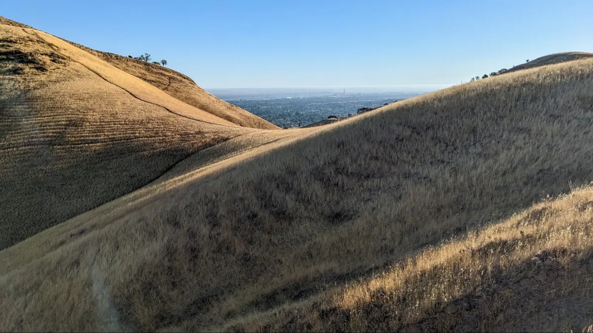
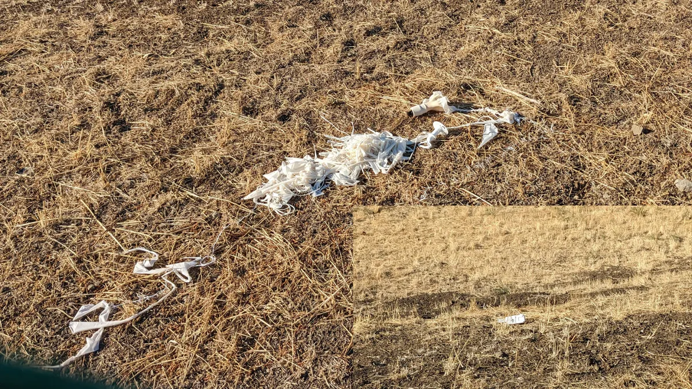
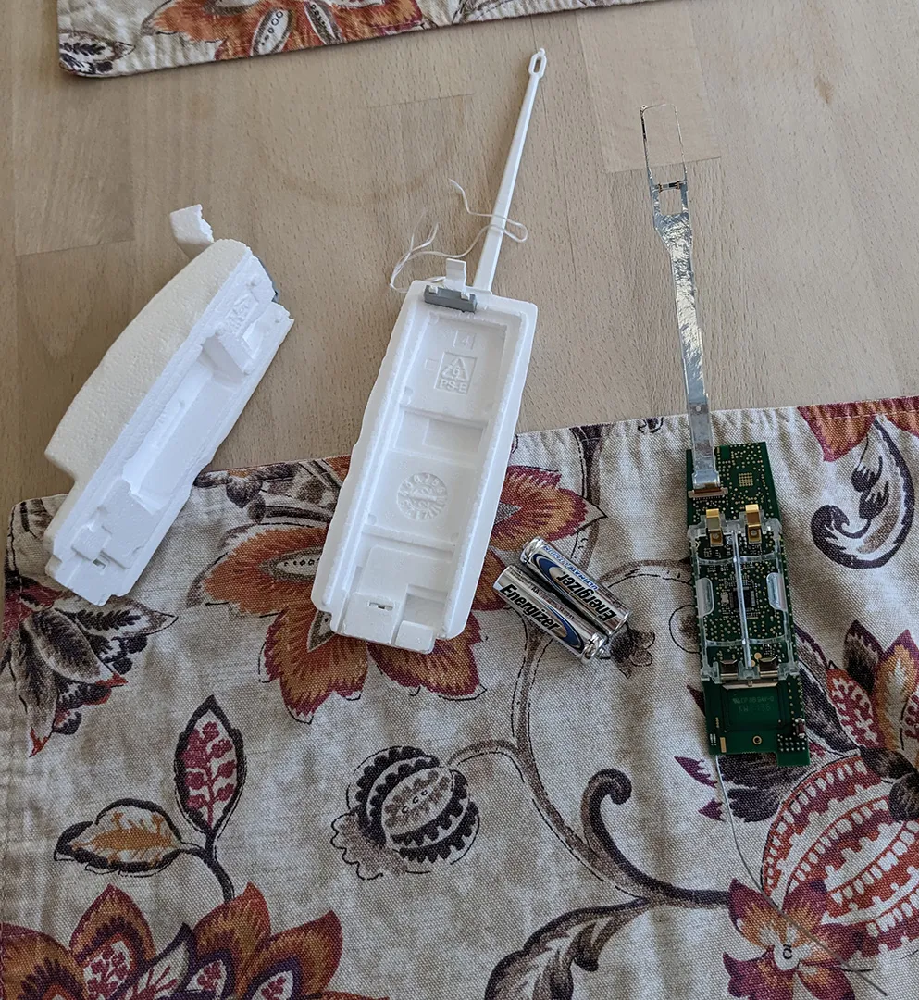
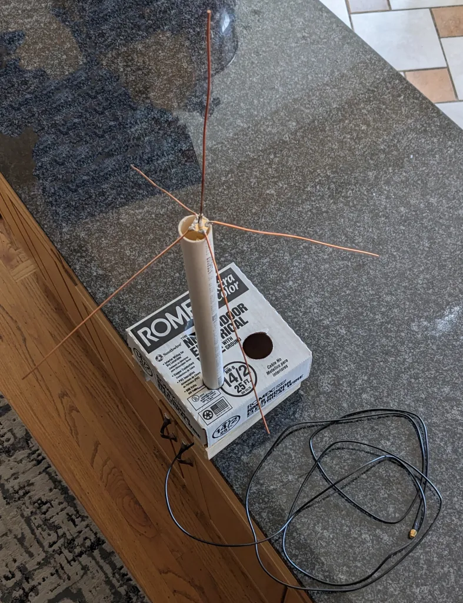

# More Balloon Tracking
November 7, 2022

Now that I had a directional antenna I could try to recover a downed balloon. Since there are at least three other people doing the same thing with balloons launched from the Oakland airport, I would need some kind of plan to be the one that gets to the balloon first. The first idea was to go for one that does not land in the usual area north east of the airport. If you remember from the last post, there was one that was launched from Moss Landing and went down way south of the airport near Morgan Hill. Since it was close to me and far from the usual balloon chasers, I should try to find that one. However, it went down two days earlier and the [SondeHub](https://tracker.sondehub.org/) site will only go back 12 hours and historical launches are only supported out of regular launch sites. I remembered the best I could and set out anyway as it was in a county park area and would be a nice hike. Needless to say, I did not find a balloon and I would need to have a better idea where it went down and I should assume the batteries will die within six hours of launch. You might have a little time where it is still transmitting after it hits the ground, but not much. You can watch the data as one flies on the SondeHub site and the battery voltage is getting pretty low. A guess after watching a couple flights with no testing; it will stop 1-4 hours after hitting the ground.

Next idea, pick a morning balloon that you have to hike a little to get to. Verify none of the usual suspects have already picked it up or are on the way to get it (you can do both of those on the web site.) Then drive out for another hike. There was a balloon one Saturday morning that went down in [Briones Regional Park](https://www.google.com/maps/place/Briones+Regional+Park/@37.7587175,-122.2353079,11z/data=!4m15!1m8!3m7!1s0x80857d8b28aaed03:0x71b415d535759367!2sOakland,+CA!3b1!8m2!3d37.8043514!4d-122.2711639!16zL20vMGRjOTU!3m5!1s0x8085637f3d30b5f9:0xc6371e790b60cfe2!8m2!3d37.9432088!4d-122.1405413!16s%2Fm%2F0286drl) and nobody seemed to be out to find it yet, so I set off with a friend to see if we could. I brought an extendable pole with this 3-D print to screw on to the end in case the balloon landed in a tree.

This is where I learned that the least significate digits in lat/long coordinates are still pretty important. I wanted to mostly go by the printed map I had, but there was some trail construction that led us to type in the coordinates I had written on the map into the phone.

So we had a six mile hike and no balloon. Someone else found it shortly after and commented that it was difficult terrain and tough to find. Next up, note a bunch that have landed near each other recently, that no one has marked found yet and try for all of them on the same trip out. I found a couple like this and the early morning one might be possible to recover also, so I set out for the Pittsburg, CA area. First, the one that just landed looks like it was at the edge of a holding pond just off the bay. I parked at a nearby marina, hiked a mile along railroad tracks and there was fencing blocking off the area the entire way. There was a point where I could probably safely climb over, but the multiple “toxic waste” signs scared me off. The second landed in school yard late Friday, so might still be there. It also was entirely fenced and locked up. This fence looked easier to clear, but I didn’t see the balloon and didn’t want the many houses that faced the school to call the cops. The third one was at the Black Diamond Regional Preserve. It should have landed just outside the public parking lot, so no issues with fences, but when I got there I figured someone else had already found it. The place where it should be was pretty much a front yard, so no way it had not already been cleaned up. Walked around a bit since I was there and it was an OK hiking area.

The last location to try for the day was in a residential area under a high-voltage tower. I walked around the small, fenced area that was under the tower and didn’t see it. There was some area around that where it could have gone and was easy to search, so I did. I decided to go around the fenced area one more time, and I saw it.

It was harder to spot than I thought it would be. I got lucky that the string connecting the balloon to the transmitter was draped over the top of the fence, so I could pull it out without having to try and jump over.

There did not seem to be a parachute and on the shell it said not to return it, but to dispose of properly. Most websites had said the NWS wanted them back to reuse, but I guess not. This prompted my wife to say "So you're driving all over to collect a bit of trash for the government?" With that, I started winding down this adventure, but still wanted to look at setting up a detector to help relay balloon positions to the web site. I made this antenna for that purpose.

Since the world ran out of Raspberry Pis, I have put off a permanent installation, but I did plug the antenna into SDR# and it works and looks like this:

[Weather balloon waterfall](https://youtu.be/HFI-4a4ELE4)
