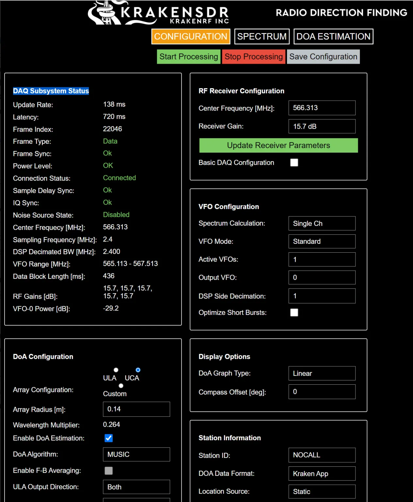
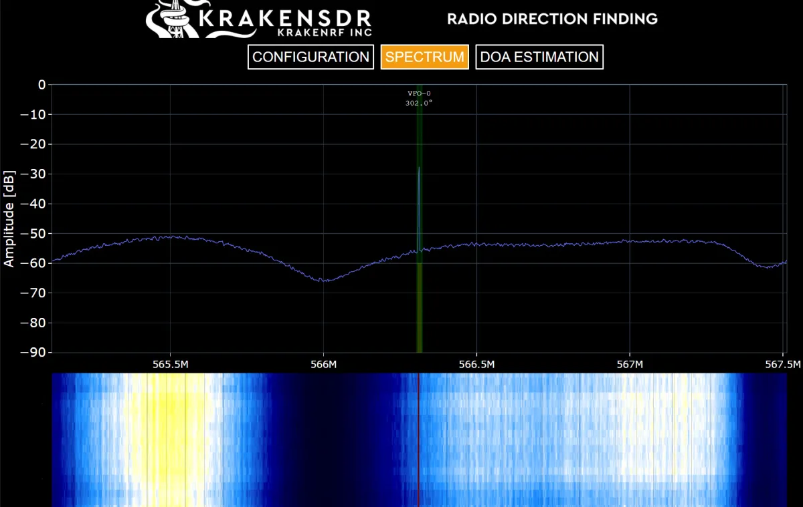
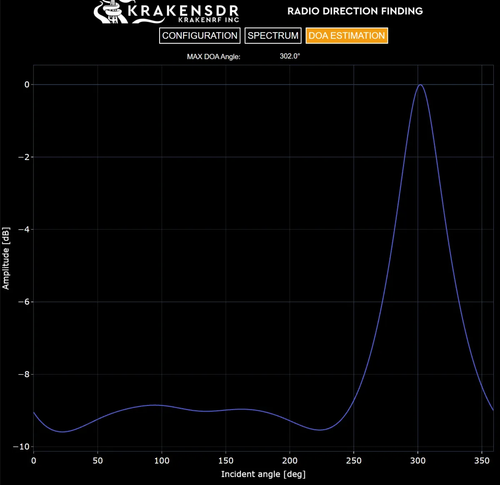
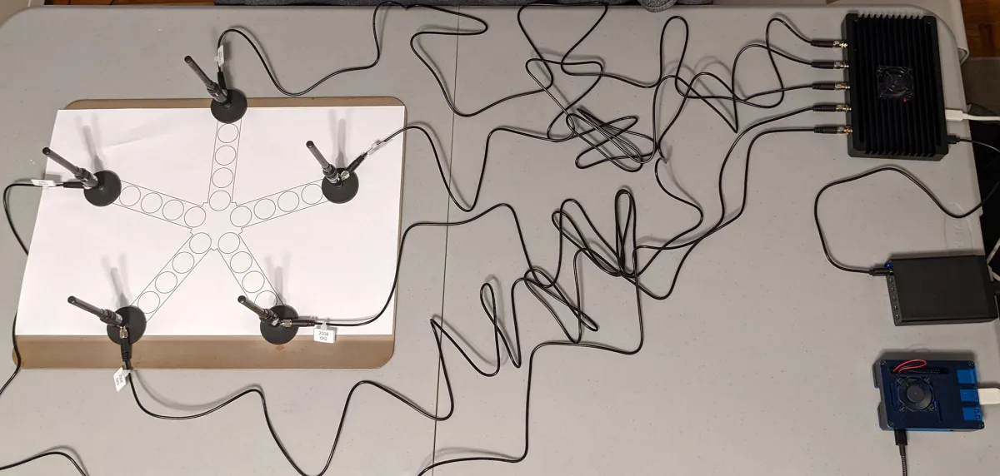

# Kraken SDR

I ordered it from [Crowd Supply](https://www.crowdsupply.com/krakenrf/krakensdr) back in November of 2021 and it was delivered 2022 August 20th. Now to try just one thing to see if it works. I gave the project of installing and over-clocking a Raspberry Pi 4b to my son over a month ago and he did pretty well, so that was all ready to go. Since it was a month ago, I forgot that I didn’t need the phone app, so I installed that and setup a hot spot (I’ll probably try something mobile later, so no loss). I eventually found proper power supplies for everything and got everything hooked up. Next I’ll go issue by issue.

I can’t log into the Pi and I don’t know why (rhymes). I am using Putty from a Windows system and after looking up the username and password and trying to connect, it hangs? It just sits there with no prompt and no error. I break out the HDMI cable and a keyboard and it is running. I start updating Linux and while doing that I add to the Putty config so I don’t have to type in the username. When I reboot the Pi and try again, it works and gives me the cert accept question as if I have never logged in before. Don’t know which part fixed that, but I’m in.

I go to the local Kraken web site (http://krakensdr:8080/config) and have no idea what I am doing. It is pretty cool that it showed up at all, so awesome. It may have connected at some point, but as I learn what things mean, the "DAC Subsystem Status" is indicating that I am not connecting to the Kraken (Connection Status should read “Connected”). I reboot the Kraken, and that does not work, so I reboot the Pi and that seems to work. I can now change the "RF Receiver Configuration" and the "VFO-0 Frequency [MHz]" and then click "Update Receiver Parameters" and I can see the reconfiguration happening in the DAQ Subsystem Status section.

What should I try to direction find first? My first thought is to try to find the weather stations that [I looked for before](sdr_weather.md). However, this proves to be a bad first target as they just chirp for a second and then don’t do anything for a minute. To figure out how to use this, it would be nice if I had a continuous source. Radio stations are a continuous source, let’s try mix-106.5-fm. I can look at the spectrum and it is definitely there and I can see some nearby stations too. Very cool, it is very much receiving RF. However, the frequency is too low and I am getting a warning that my tiny array of antennas cannot direction find. I don’t want to try to make this thing larger right now, so let’s move to a higher frequency. I look up what might be around and maybe 900 MHz might be interesting? I look in the amateur band and find more chirping so I look around and find something continuous but then I get a warning that the array is too big. I probably should have ready about this a little while waiting for the thing to ship. [This thing](https://www.ntia.doc.gov/files/ntia/publications/2003-allochrt.pdf) says there is some broadcast TV in the 600 range. Maybe that will work? I poke around and find PBS out of San Francisco, that should be good if it is there. Hey, it seems to be there and I [can look up](https://en.wikipedia.org/wiki/KQED_(TV)) where they are broadcasting from. Perfect! It doesn’t even give me an array size warning. The Kraken config section looks like this (configured to pick up PBS San Francisco):

And the SPECTRUM and DOA ESTIMATION sections look like this (don't know why there is nothing around this. UPDATE: the FCC is probably clearing this spectrum and this is the last thing around?):

Here is the direction graph:

The location is strong and in the right general direction. However, when I go to Google Earth to get a direction, it looks like it is off a bit. I check where I actually put antenna 0 (which I said was at 0 degrees) and it is a bit left of north. So congratulations to the KrakenSDR with a sub-par setup. It seems to have gotten this pretty much correct. Here is the sub-par setup (Kraken upper-right, Pi lower-right with the antennas on a baking sheet to the left):

Wait, the antennas are on a baking sheet? So while I was debugging the SSH issue, I plugged a monitor into the Pi. I decided to unplug it when looking around in 900MHz and it seemed to suddenly not see signals as clearly. I don’t know why that happened, but I remembered Phil from [Scanner School](https://www.scannerschool.com/) saying something about antennas needing a ground plane sometimes. His hack was to use a baking sheet and since these things are supposed to be on top of a car, I figured I would try it. I think it was better, but I don’t have a pre/post to show. Overall, things seem to work and I was happy with the day’s work.
