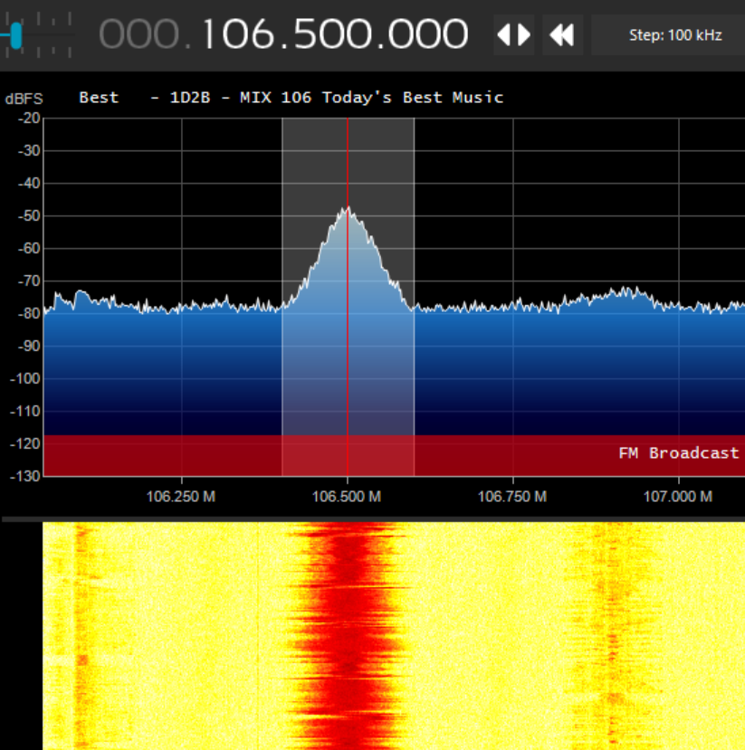
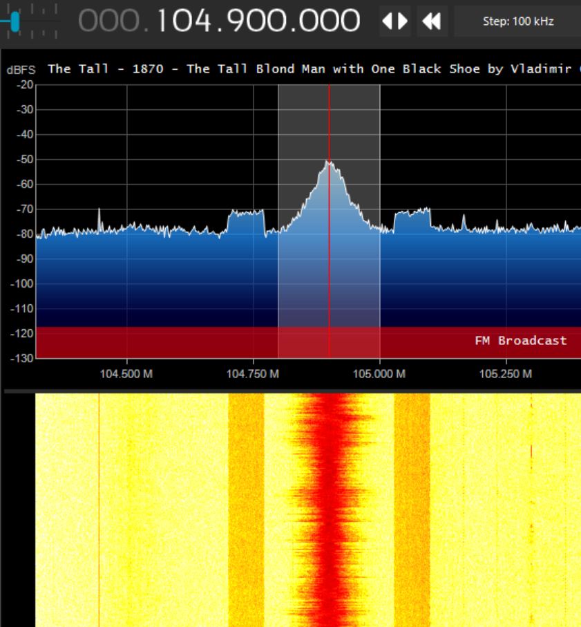

# Software Defined Radio RTL-SDR with Windows and SDRSharp
This was the post just before the Gnu Radio series.

Why order one toy when you can get two? I decided to try both an RTL-SDR.COM USB v3 SDR and a HackRF One. The rtl-sdr came first and I quickly realized that I would need to write down everything I do to get things working in case I ever needed to do it again. I wanted to be able to use several different tools and as a new software tool interfered with another I wanted to know exactly what I did to get each thing working. First up in what should be a series of posts, get SDR# running on Windows 10.

I wanted to get started on Windows 10 as this would get me the drivers and test that everything worked on a host machine. SDR# also turns out to just be easy and fun to use as well. This part was mostly straight forward and started with the [quick-start guide](http://rtl-sdr.com/qsg) pointed to in the package. These were my results following their instructions:

1. I ordered the hardware from Amazon and it looks like I got the one sponsored by the website, so good.
2. I downloaded the .Net 5.0 installer and ran it. That worked fine. However the C++ redistributable link didn’t work, so I just verified that it was already installed by going into Windows settings and Apps, and there were a bunch of C++ dlls, so I assumed I was fine.
3. I downloaded the AirSpy package as noted
4. I unzipped it and moved the directory to C:, so the working directory was C:/sdrsharp-x86 (I have a few other things that run out of a directory like this and I just put them all in C:/)
5. I ran the install-rtlsdr.bat, and surprisingly, that worked fine and the two files noted were now in the directory (I will probably compress and save the directory, with the working files, just in case).
6. I plugged in the dongle, waited a minute and proceeded. As far as I can tell, Windows did nothing with the hardware. No sound to indicate it was installed, no pop-ups or notifications.
7. I then ran zadig.exe as administrator (yes, you are trusting that this is OK).
8. The program ran and I chose Options->List all devices as instructed.
9. I have a bunch of USB devices and my dongle showed up under one of the alternate names, so I did the double-check to make sure the ID contained '2838'.
10. The WinUSB driver was already selected on the right side and my activation button said "Install Driver" instead of "Replace Driver". This seems to support that Windows didn’t do anything when I plugged it in.
11. After clicking Install, and letting the software run, it seemed to be fine.
12. I double-clicked SDRSharp.exe to run and it started fine. I also dragged a short-cut out to the desktop (press <ALT> before you drop to get a short-cut).
13. I selected the RTL-SDR USB as the source. This drop-down was in the lower part of the left-hand-side for me.
14. Before pressing the play arrow and getting something interesting, I needed to click the cog button in the upper left and set the RF Gain slider up (37.2 dB in my case). Then I set the frequency to a local FM channel (000.106.500.00). The top and bottom of each number up top can be clicked to get this to what you want. You should also see that it will tell you the range you are in with a red band with some text (FM Broadcast if you choose the same frequency). Last, in the Radio configuration section in the upper right, choose the WFM (Wideband FM) radio button. Now press the play button upper-left (even if it seems grayed out) and it should do what you would expect (play music and show the carrier wave and log).

Some notes from this part:

* I did have to setup the antenna that came with the device, but I just pulled out a little antenna on the top of the dipole and a bit more on the bottom (so it would balance and not turn) and laid it on the desk. Probably a horrible setup, but still worked fine to test with FM.
* The dongle heats up pretty good. Not too hot to touch, but hot.
* SDR# is doing a bunch of stuff for me. Other than the gain and radio type, it seems to do everything for me, like the sound output.
* I just picked an FM station I know in the bay area. If you pick the same, you will notice it is also displaying the station name in the top of the graph. So we are getting some text info and SDR# is doing the right thing with it.

* If you tune to 104.9 in this area, you get a classical station and now that text is showing the song name and there are two more square looking peaks in the waveform on either side of the main peak. Maybe the digital channel that shares the station frequency?

